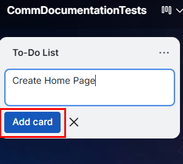
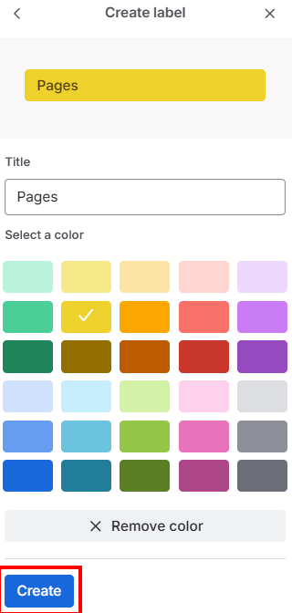
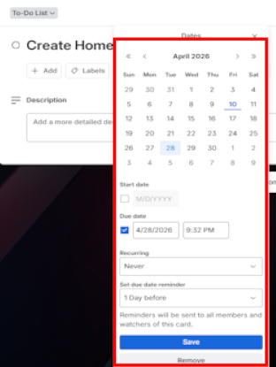

# Creating a To-Do List

## Overview

These few short steps will teach you how to create a To-Do List in Trello. This is a staple addition for team collaboration so that all members
can actively see the tasks that they need to do. The list will include tasks in the form of cards where your team members can see specific 
details of each task clearly.

!!! warning "Warning"
    Reminder that you must have created and entered into an empty Trello board before proceeding with these steps.

## Creating a list

1. **Click** [Add a list] located in the top left under your Trello board name.

    ![Image showing the location of [Add a list].](assets/add-list.png "Adding a list to trello board"){ height="200" }

2. **Type** a meaningful list name where it prompts you to enter the list name (e.g. *To-Do List*).

3. **Click** [Add list] after choosing a suitable name.

!!! success "Success"
    If the top left of your Trello board looks like this, you have succeeded.

    { width="400"}

## Creating a Card

1. **Click** [Add a card] which appears below the newly created list.

    ![Image showing the location of [Add a card].](assets/add-card.png "Adding a card to the list"){ height="200" }

2. **Type** A meaningful title for a task where it prompts you to enter a title (e.g. *Create Home Page*). 

3. **Click** [Add card] after choosing a suitable title.

    { height="200" }

4. (Optional) Repeat tasks 1-3 to create as many cards of tasks as you want. Move on when finished.

!!! success "Success"
    If the list looks like this, you have succeeded.

    { height="200" }

## Customizing a Card

1. **Hover** over an existing card and **click** on the  :fontawesome-solid-edit:  icon that appears on the top right of the card.

    ![Image of mouse hovering over the [edit card] icon](assets/click-edit-card.png "The [edit card] icon"){ height="200" }

2. **Click** [Open card] from the menu that appeared beside the card.

3. **Click** [Labels] and then **click** [Create a new label].

    ![Image navigating to the [Create a new label] prompt](assets/go-to-labels.png "Navigating to create a label"){ height="200" }

4. **Type** a meaningful title to identify the task and choose a colour.

5. **Click** [Create] when finished.

    { height="200" }

6. **Click** [Dates].

7. **Choose** a date for when the task is due.

    { height="200" }

8. **Click** Save.

9. **Click** the  :octicons-x-12:  icon on the top right of the card when finished.

10. (Optional) Repeat tasks 1-8 for each card you want to customize. Move on when finished.

    !!! info "Info"
        There are more features and customizations you can make for your Trello cards, including adding checklists or attachments. The documentation does not cover this, but consider familiarizing yourself with them to be more proficient in using Trello.

!!! success "Success"
    If the cards look like this, you have succeeded.

    { height="200" }

## Conclusion

If you have followed these instructions, you should have a fully created list of tasks for your teammates to do.

!!! success "Success"
    You can now create a list, populate it with cards, and customize the cards to fit your needs.

